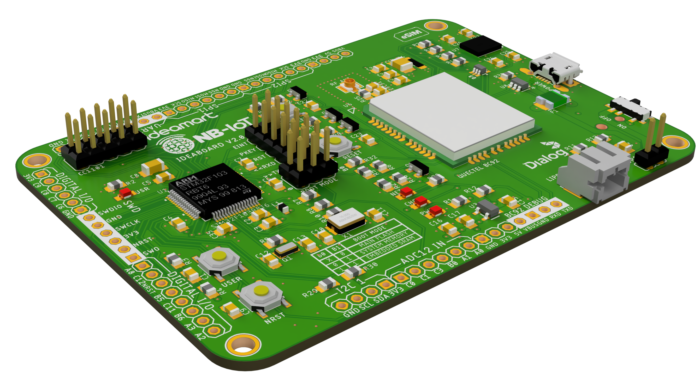
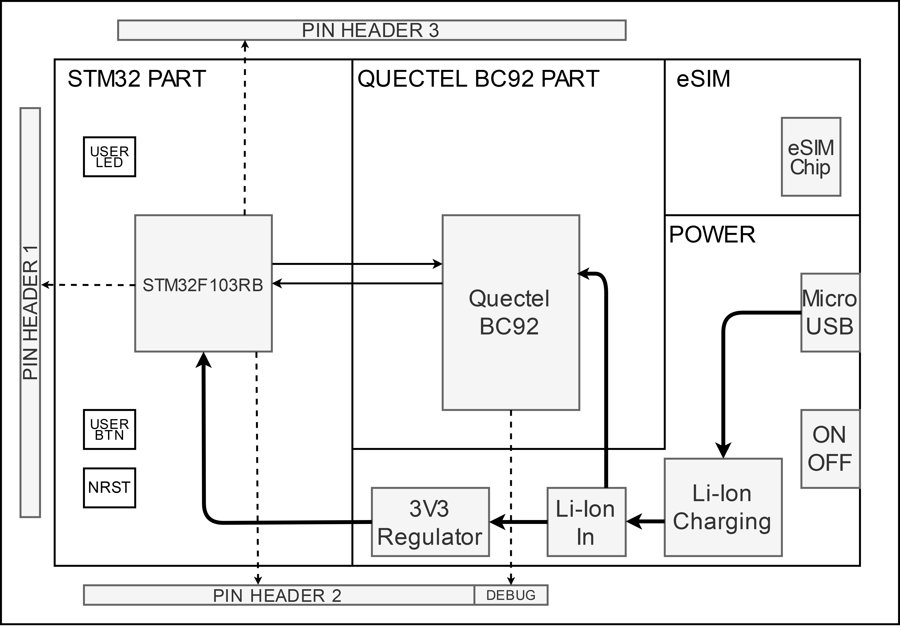
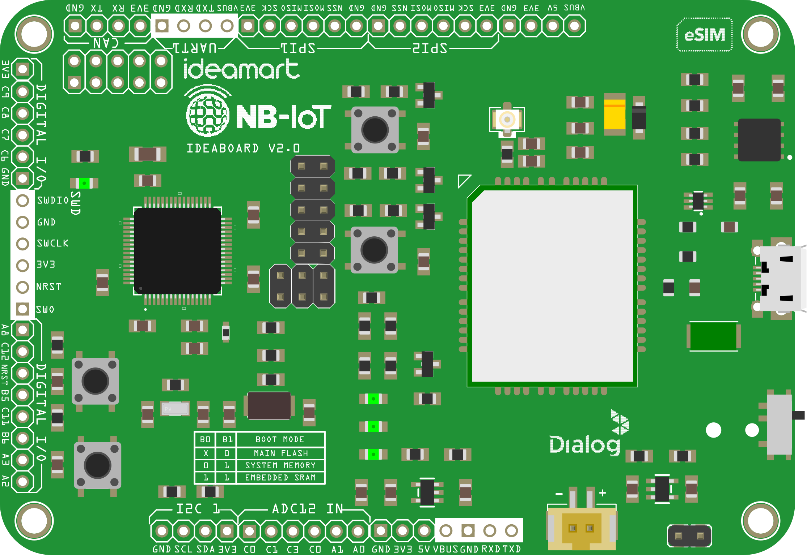
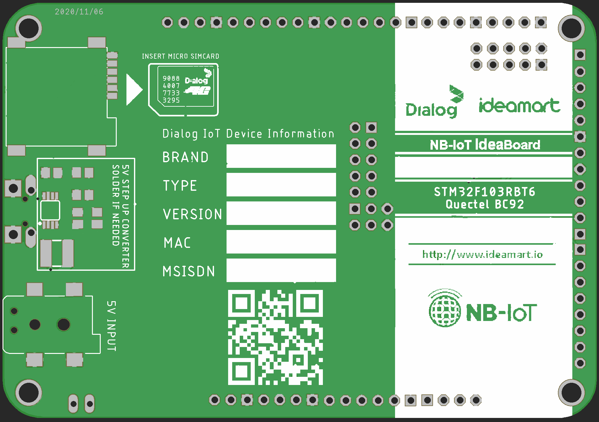
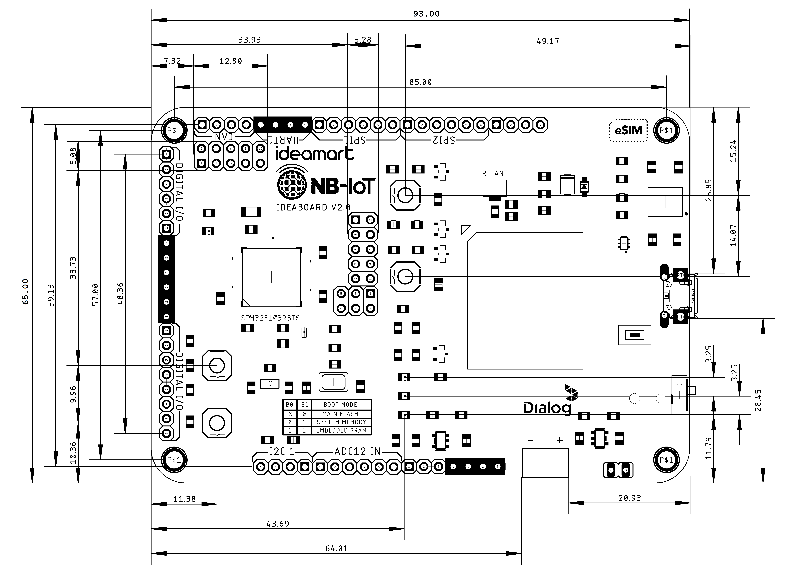
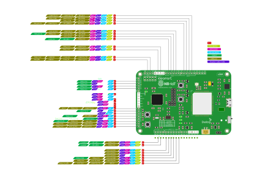
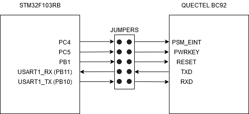
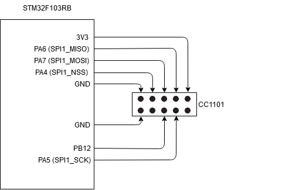

# Ideamart NB-IoT Ideaboard
###### version 2.0

## Introduction



Ideamart NB-IoT Ideaboard is a connected battery-powered quick-prototyping board created for IoT developers and makers. Its purpose is to make IoT device developemtn process quick and easy as possible. It has communication interfaces such as I2C, SPI, USART, CAN, along with a 12-bit ADC and 16-bit PWM pins broken out with power supply pins, so that any sensor/actuator module in the market can be hooked up to it easily wihout hassle.

It is powered by a 3.7V Li-Ion cell which is managed by an onboard Li-Ion charge controller, making it ideal for prototyping IoT devices. Its main MCU is a powerful STM32F103R series microcontroller with 128K Flash and 20K SRAM memory, enough to make any IoT application effortlessly. It can be connected to the NB-IoT network via a Quectel BC92 modem with 2G GSM fallback option while supporting MFF2 or 3FF eSIM giving it full internet access. 

View 3d model: https://a360.co/3fFFWQ6

## Features
The Ideaboard offers the following features
1.	STM32F103RB microcontroller in LQFP64 package with pin compatibility to any other STM32F103R series microcontroller
2.	Onboard Quectel BC92 BN-IoT modem with 2G GSM fallback
	- LTE Cat NB2: B3/B5/B8/B20/B28
	- GSM: 850/900/1800/1900 MHz
3.	Lithium-Ion cell as primary power supply and onboard Li-Ion management 
    - A 3.7V 2400mAh Li-Ion cell is used to directly power the BC92 modem and the microcontroller
    - Single cell Li-Ion battery management unit for safe charge/discharge of the Li-Ion cell
4.	Flexible power outputs
    - 3.3V power output for basic sensor/actuator power (max usage: 400mA)
    - Optional 5V power output boosted from the 3.7V Li-Ion cell for 5V applications (not available by default)
    - VBUS pins connected to the USB VBUS rail to supply power to the board
5.	External power supply
    - Micro USB port for easy power supply connection
    - External DC 5V source for 2.1 DC connector
6.	Power management access point
    - Connector to an external current meter/ammeter to measure the amount of power drawn from the Li-Ion cell to the Ideaboard
7.	SWD or UART programming
    - Onboard boot mode selection for switching between programming modes
8.	4 LEDs: PWR, USR, NET, and CHG
    - PWR: Board power on indicator
    - USER: User configurable LED
    - NET: BC92 Modem Network status indicator
    - CHG: Li-Ion cell charging indicator
9.	4 pushbuttons: NRST, USER, RESET, PWRKEY
    - NRST: STM32F103RB microcontroller Reset button
    - USER: User configurable pushbutton for input
    - RESET: BC92 modem reset button
    - PWRKEY: BC92 modem power on/off button
10.	Pinheaders to access GPIOs
    - ADC12 IN: 6 GPIOs for 12—bit ADC input
    - I2C 1: GND, SCL, SDA, 3V3 pins for I2C 1 port
    - CAN 1: GND, TX, RX, 3V3 pins for CAN bus port
    - USART 1: VBUS, TXD, RXD, GND, 3V3 pins for USART 1 port
    - SPI 1: 3V3, SCK, MISO, MOSI, NSS, GND pins for SPI 1 interface
    - SPI 2: GND, NSS, MOSI, MISO, SCK, 3V3 pins for SPI 1 interface
    - SWD: SWDIO, GND, SWCLK, 3V3, NRST, SWD pins for SWD programming/debug interface
    - Other GPIOs: A mix of digital and analog I/O pins with no specific assignment for general I/O purposes
11.	Debug UART port for BC92 modem
    - Debug port with VBUS, GND, RX, and TX pins to access the debug COM port of the BC92 modem
12.	eSIM technology or MircoSim compatibility
    - Onboard eSIM MFF2 chip or microsim connector for SIM connection whichever can be used according to user preference
13.	IPEX/u.FL antenna connector for BC92 modem RF antenna
    - Impedance matched to 50 Ohms with optional “PI” type matching circuit reserved for antenna optimization

## STM32F103RB Microcontroller

The STM32F103RB microcontroller is a medium-density performance line family incorporating the high-performance ARM®Cortex®-M3 32-bit RISC core operating at a 72 MHz frequency, high-speed embedded memories with 128K Flash and 20K SRAM (covering from 16 Kbytes to 1 Mbyte of Flash in the STM32F130R line) and an extensive range of enhanced I/Os and peripherals connected to two APB buses. 
All devices in the family offer two 12-bit ADCs, three general purpose 16-bit timers plus one PWM timer, as well as standard and advanced communication interfaces: up to two I2Cs and SPIs, three USARTs, an USB and a CAN.
Key Features
1. ARM 32-bit Cortex -M3 CPU Core
    - 72 MHz maximum frequency,1.25 DMIPS/MHz (Dhrystone 2.1) performance at 0 wait state memory access
    - Single-cycle multiplication and hardware division
2. Memories
    - 128 Kbytes of Flash memory
    - 20 Kbytes of SRAM
    - Clock, reset and supply management
3. 2.0 to 3.6 V application supply and I/Os
    - POR, PDR, and programmable voltage detector (PVD)
    - 8 MHz crystal oscillator
    - Internal 8 MHz factory-trimmed RC
    - Internal 40 kHz RC
    - PLL for CPU clock
    - 32 kHz oscillator for RTC with calibration
4. Low power
    - Sleep, Stop and Standby modes
5. 2 x 12-bit, 1 μs A/D converters
    - Conversion range: 0 to 3.6 V
    - Dual-sample and hold capability
    - Temperature sensor
6. DMA
    - 7-channel DMA controller
    - Peripherals supported: timers, ADC, SPIs, I2Cs and USARTs
7. Debug mode
    - Serial wire debug (SWD)
8. 7 timers
    - Three 16-bit timers, each with up to 4 IC/OC/PWM or pulse counter and quadrature (incremental) encoder input
    - 16-bit, motor control PWM timer with dead-time generation and emergency stop
    - 2 watchdog timers (Independent and Window)
    - SysTick timer 24-bit downcounter
9. Communication interfaces
    - I2C interfaces (SMBus/PMBus)
    - USARTs (ISO 7816 interface, LIN, IrDA capability, modem control)
    - SPIs (18 Mbit/s)
10. CAN interface (2.0B Active)
    - CRC calculation unit, 96-bit unique ID

## Quectel BC92 NB-IoT/GSM modem

BC92 is a high-performance, multi-band NB-IoT/GSM dual-mode module with extremely low power consumption. Designed to be compatible with Quectel GSM/GPRS M95 module, NB-IoT BC95-G module and LPWA BG95 module, BC92 provides abundant external interfaces and protocol stacks, providing great convenience for customers' applications.
BC92 supports 3GPP R13 and R14. Its general features are shown below.
- Support GSM850, EGSM900, DCS1800 and PCS1900
- Support GPRS data transmission and GSM SMS service
- Designed with power-saving technology, the current consumption is as low as 4 μA in deep sleep mode
- Integrate various Internet service protocols (TCP, UDP, PPP, FTP, HTTP(S)
- Support extended AT commands

The frequency bands supported by BC92 are listed below.
- LTE Cat NB2: B3/B5/B8/B20/B28
- GSM: 850/900/1800/1900 MHz

BC92 is an SMD type module with 50 LCC pins, which can be embedded into a variety of data transmission applications with a compact profile of 23.6 mm ×19.9 mm ×2.2 mm, BC92 can meet almost all requirements for M2M applications, such as smoke detector, wireless meter reading, bike sharing, smart parking, asset tracking, wearables, etc.

Power Supply
- Supply voltage range: 3.4~4.2 V.
- Typical supply voltage: 3.8 V.
- Deep Sleep Mode Typical current consumption in Deep Sleep Mode: 4 μA

NB-IoT Frequency Bands
- B3/B5/B8/B20/B28

NB-IoT transmitting power
- 23 dBm ±2 dB

For more information on the STM32F103RB microcontroller or the Quectel BC92 modem, please visit www.st.com or https://www.quectel.com/product/bc92.htm

## QuickStart

The Ideamart NB-IoT Ideaboard is a low-cost and easy-to-use IoT prototyping platform designed for IoT developers and makers which can be used to quickly test and implement a connected IoT solution.  

### Getting started

Follow the sequence below to configure and power up the Ideaboard

1. Make sure a 3.7V Li-Ion battery is connected to the LIPO connector

2. Check the jumper positions on the board
    - Make sure JP1 jumper near the LIPO connector is connected
    - Make sure all 5 of MODEMCTL jumpers are connected parallel to the length of the board
    - Position of the B1 and B0 jumpers of the BOOT MODE selector. (Refer the table on the board or this document to select the boot mode according to your programming preference)

3. Connect the Ideaboard to a PC or a 5V power adapter with a micro USB cable through the POWER USB connector or using a 5V DC power supply through to the 2.1mm barrel connector on the bottom side of the board. The CHG LED will turn on indicating that the Li-Ion cell is charging. 

4. Turn the power switch on. The PWR LED will turn on indicating that Ideaboard is getting power from the Li-Ion cell.

## Hardware layout and configuration

The Ideaboard is designed around the STM32F103RB MCU in a 64-pin LQFP package as the main controller.

### Hardware block diagram


#### Top Layout


#### Bottom Layout


### Ideaboard mechanical dimensions


### Pinout Diagram


### Power supply and Battery Management

The Ideaboard’s main power supply is it’s 3.7V Li-Ion cell. It must always be connected although an external power source is used. The external power supply charges the Li-Ion cell while the cell powers the board. 
The power switch must be turned on to get power to the board. Then the PWR LED will turn on.  When as external power supply is connected, the battery will start charging and it will be indicated by the CHG LED. 
The external power supply must be 5V and can be connected to the POWER micro USB port or the 5V DC input jack on the bottom side of the PCB.

The 3.3V rail is powered by a 3.3V LDO which is directly connected to the Li-Ion cell. An optional 5V step-up converter is also powered by the Li-Ion cell for any external 5V peripherals.

#### Powering external peripherals using the Ideaboard

3.3V peripherals can be connected to the 3V3 pins on the Ideaboard for power.For 5V peripherals, the 5V pins on the Ideaboard can be used. These pins will not have power unless the 5V step-up converter on the bottom side of the Ideaboard is soldered. 

The VBUS pins can also be used to provide 5V power to external peripherals, but it is not recommended since the VBUS rail will lose power once the external power is removed, therefore, use the 5V step-up converter. 

All the VBUS pins are connected to the VBUS of the USB port and the positive terminal of the 5V DC input.

#### Using the onboard 5V step-up converter

The 5V step-up converter is soldered by default. Please refer the below table when assembling the parts for the 5V step-up converter.
| Designator | Value | Component | Package | Manufacturer Part # |
| ----------- | ----------- | ----------- |----------- |----------- |
|   U4      |   PAM2401 |   Step-up converter	|   MSOP8	    |PAM2401SCADJ   |
|   C20     |   22uF    |   Ceramic Capacitor   |   0805 SMD    |   -           |
|   C21     |   22uF    |   Ceramic Capacitor   |   0805 SMD    |   -           |
|   R14     |   750k    |   Resistor            |   0805 SMD    |   -           |
|   R15     |   750k    |   Resistor            |   0805 SMD    |   -           |
|   R16     |   100k    |   Resistor            |   0805 SMD    |   -           |
|   L2      |   2.2uH/3A|   Inductor            |   4x4mm SMD   |IFSC1515AHER2R2M01|

#### Measuring the Ideaboard’s power consumption

The power consumption can be measured by connecting an ammeter to the JP1 pins on the ideaboard. This will give the current drawn from the Li-Ion cell by the Ideaboard and the connected peripherals. 

Once the current measuring device is removed, the jumper must be put back on the JP1 pins in order for the Ideaboard to work.

#### LEDs and Pushbuttons

The ideaboard has 4 LEDs and 4 pushbuttons 
##### LEDs
- PWR: Power on indicator.
- USR: An LED connected to PB13 pin of the MCU
- CHG: Li-Ion cell charging indicator
- NET: Network status of the BC92 modem

##### Pushbuttons
- USER: A pushbutton connected to PC13 pin of the MCU
- NRST: Reset pin of the STM32F103RB MCU
- PWRKEY: Powerkey button for the BC92 modem. 
- RESET: Reset button for the BC92 modem

### NB-IoT Modem Communication

The STM32F103RB MCU communicates with the Quectel BC92 modem through a UART port. 
The modem is connected to USART3 of the MCU. The control signals to the modem from the MCU are PSM_EINT, POWERKEY, and RESET. 
All the UART and control signals are connected to the MCU via jumpers in case the developer needs to disconnect the modem communication or control signals from the MCU. Please refer the below figure for the connections.



### CC1101 connector

The Ideaboard has a 2.54mm pitch 2x6 female pinheader connector for a CC1101 radio module. This is connected to the MCUs SPI1 port. Please refer below figure for the pin connections.



## Programming the Ideaboard

Ideaboard can be programmed using its SWD or USART1 interface. The 2 programming interfaces are highlighted on the top side of the PCB in white. In order to use either programming mode, the boot mode of the MCU must be selected by setting the B0 and B1 jumpers on BOOT pin header as given in the table below.

| BOOT0 |   BOOT1   | Boot mode         | Aliasing  |
| ----- | --------- | ---------         | --------  |
|  x    |       0   | Main Flash Memory | Main flash memory is selected as boot space   |
|  0    |       1   | System Memory     | System Memory is selected as boot space       |
|  1    |       1   | Embedded SRAM     | Embedded SRAM is selected as boot space       |

### Using the SWD Interface

The main flash memory is used as boot space. To select the boot mode of the MCU, set the BOOT jumpers as below:

````
B0 = 0 and B1 = 0
````

After setting the jumpers Reset the MCU.

When using the SWD interface, an external ST-Link programmer such as ST-Link V2 dongle can be used.

The pins 2, 4, and 6 on the ST-Link V2 programmer should be connected to SWCLK, SWDIO, and GND on the Ideaboard SWD pin header respectively.

### Using the USART 1 Interface

When using the USART1 interface, the boot loader in the system memory must be activated. Set the BOOT jumpers as below. This embedded boot loader is programmed by ST during production.

The system memory is used as boot space. To select the boot mode of the MCU, set the BOOT jumpers as below:
````
B0 = 1 and B1 = 0
````

After setting the jumpers Reset the MCU.

In order to use the USART1 interface, a USB to serial converter should be used by connecting it to the RXD, TXD, and GND pins of the Ideaboard. (The VBUS pin can be used to charge the Li-Ion cell if needed).

After installing the STM32 board definitions, Arduino IDE can be used to program the Ideaboard using the USART1 interface.

### Using the CDC Virtual com port

Using the micro USB port, a CDC Virtual com port can be opened, and any serial prints/debugging information written in the MCU code can be received to the computer without using a USB to serial converter.